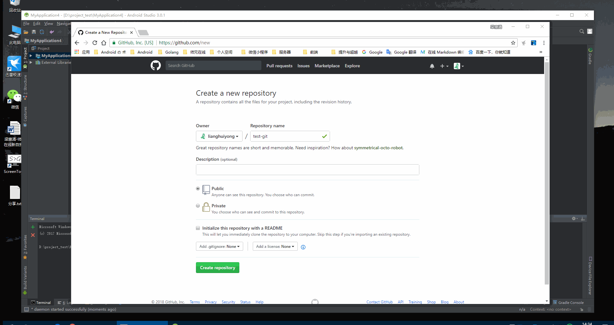
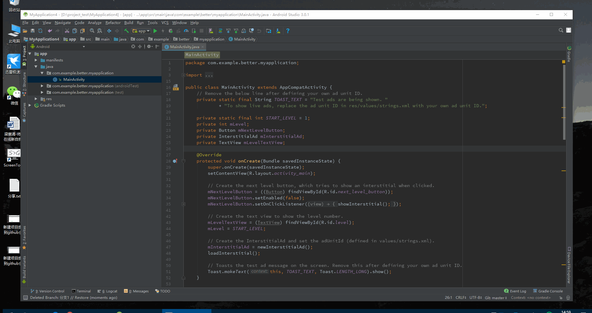
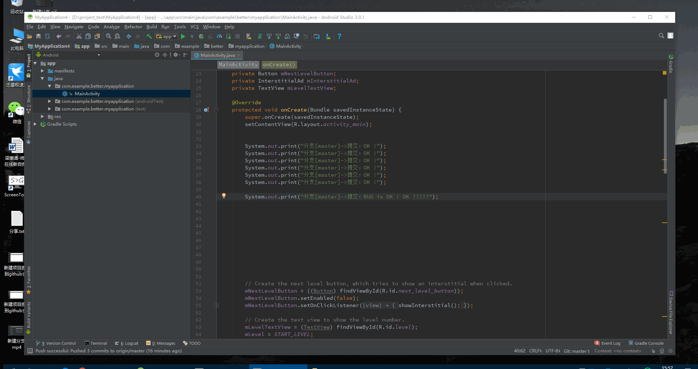

[Git 下载](https://git-scm.com/downloads)

##### Git 配置
```shell
$ git config --global user.name "梁惠涌"
$ git config --global user.email “lianghuiyong@outlook.com”
```
##### Git 需了解点

1、远程仓库（remote）

2、本地仓库（local）

3、分支

4、节点

[《Git - 简易指南》](http://www.bootcss.com/p/git-guide/)

[《Pro Git》第二版（简体中文版）](https://bingohuang.gitbooks.io/progit2/content/)

##### 编译器与插件

1、[IDEA编辑器](https://www.jetbrains.com/idea/)

2、[ignore插件使用](http://blog.csdn.net/qq_34590097/article/details/56284935)

**1、新建项目提交到GitHub仓库**


[视频下载](http://oeqej1j2m.bkt.clouddn.com/%E6%96%B0%E5%BB%BA%E9%A1%B9%E7%9B%AE%E6%8F%90%E4%BA%A4%E5%88%B0github%E4%BB%93%E5%BA%93.mp4)


**2、新建分支**


[视频下载](http://oeqej1j2m.bkt.clouddn.com/%E6%96%B0%E5%BB%BA%E5%88%86%E6%94%AF.mp4)


**3、合并分支**


[视频下载](http://oeqej1j2m.bkt.clouddn.com/%E5%90%88%E5%B9%B6%E5%88%86%E6%94%AF.mp4)


**4、回滚节点**

回滚节点（mixed）参数说明：
```
--mixed是reset的默认参数。
它将重置index和HEAD回滚到指定节点的状态。本地文件内容不会发生改变。需要修改后commit push 一次！
```

[视频下载](http://oeqej1j2m.bkt.clouddn.com/%E5%9B%9E%E6%BB%9A%E8%8A%82%E7%82%B9.mp4)


**5、删除分支**


[视频下载](http://oeqej1j2m.bkt.clouddn.com/%E5%88%A0%E9%99%A4%E5%88%86%E6%94%AF.mp4)


```
一：常规办法
1.删除无用的分支
$ git branch -d <branch_name>
2.删除无用的tag
$ git tag -d <tag_name>
3.清理本地版本库
$ git gc --prune=now

二：高级办法
注意高级办法会导致push冲突，需要强制提交，其他人pull也会遇到冲突，建议重新克隆。
！！！注意这些操作都很危险，建议找个示例库进行测试，确保自己完全掌握之后再实际操作。

1.完全重建版本库
$ rm -rf .git
$ git init
$ git add .
$ git cm "first commit"
$ git remote add origin <your_github_repo_url>
$ git push -f -u origin master

2.有选择性的合并历史提交
$ git rebase -i <first_commit>

会进入一个如下所示的文件
  1 pick ba07c7d add bootstrap theme and format import
  2 pick 7d905b8 add newline at file last line
  3 pick 037313c fn up_first_char rename to caps
  4 pick 34e647e add fn of && use for index.jsp
  5 pick 0175f03 rename common include
  6 pick 7f3f665 update group name && update config

将想合并的提交的pick改成s，如
  1 pick ba07c7d add bootstrap theme and format import
  2 pick 7d905b8 add newline at file last line
  3 pick 037313c fn up_first_char rename to caps
  4 s 34e647e add fn of && use for index.jsp
  5 pick 0175f03 rename common include
  6 pick 7f3f665 update group name && update config

这样第四个提交就会合并进入第三个提交。
等合并完提交之后再运行
$ git push -f
$ git gc --prune=now
```